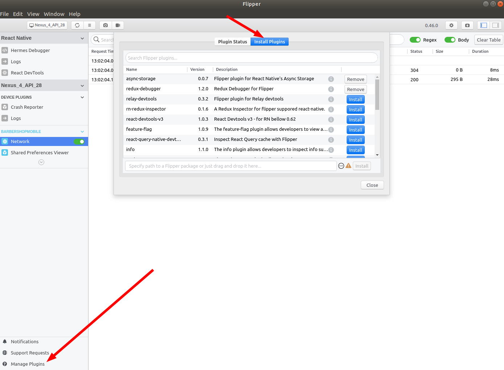

<p align="center">
  

  

  

  

  <a href="https://www.linkedin.com/in/pablosatler/">
    
  </a>

  

</p>

# Barbershop Mobile
> App created with React Native

This will consume the API created at [this repository](https://github.com/psatler/barbershop-backend).


## Dependencies

- Typescript
- ESLint
- Prettier
- Styled Components
- [React Navigation v5](https://reactnavigation.org/)
- Unform/core and Unform/mobile
- Yup (for handling errors)
- Axios
- React Native Async Storage
- [Lint-staged](https://github.com/okonet/lint-staged) and [Husky](https://github.com/typicode/husky) for pre-commit checks
- [React Native Date Time Picker](https://github.com/react-native-community/datetimepicker) for selecting dates.
<!-- -
- Polished
- React Spring -->


### Acknowledments

- You can run `adb reverse tcp:3333 tcp:3333` to be able to fetch the api using _localhost_. Another adjust you can do it to find your IP local address, for example,
`192.168.15.17` and replace it on the [backend](https://github.com/psatler/barbershop-backend) at the variable _APP_API_URL_ in the `.env` file, so it becomes
`http://192.168.15.17:3333`. **Remember**: you got to be using the same network to perform requests on localhost.
- If you're using an Android emulator, for example, you might need to run `adb reverse tcp:8081 tcp:8081` before performing requests to the IP address you set above.

###### Using Flipper for debugging

With Flipper, we can view the React tree with _React DevTools_ and also check the network requests the app makes.

You can download flipper from [https://fbflipper.com/](https://fbflipper.com/). On Ubuntu, for example, a `.zip` file will be downloaded. After that, you can open the application by running it, like showed [here](https://github.com/facebook/flipper/issues/1058#issuecomment-620043782).

```
cd ~/Downloads/flipper
./flipper
```
You can find more info about it at the [setup page](https://fbflipper.com/docs/getting-started/react-native) in their documentation.

You can install plugins, for example, for `async storage`, `redux`, etc, by going to _manage plugins_  at the bottom left, and then, going to _install plugins_, like shown below:

<!-- <p align="center" style="display: flex; align-items: center; justify-content: space-around;"> -->
<p align="center" style="display: flex; align-items: center; justify-content: space-around;">
    
</p>


